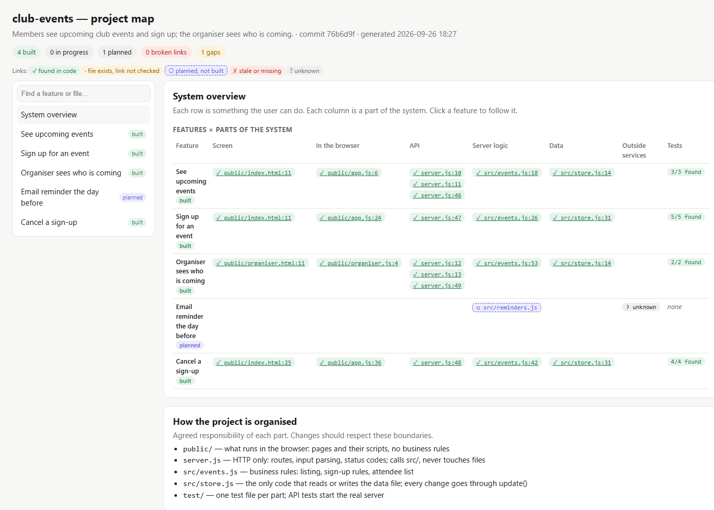

# Proofcard

**A living map of your project, kept honest by your code.** For every feature, one page shows what the user does, which screen and files do it, what happens behind the screen, where the data goes, what it relies on, which tests cover it, what isn't tested, why it's built that way, and its known problems. Every link points at a real line of code and is checked again on every run.

It's built for projects made with Claude Code or Codex. The assistant reads the map before a change and updates it after, and the tool catches it when the map and the code drift apart.



**See it live:** [club-events map](https://moosartist.github.io/proofcard/demo/club-events.html) · [the same project at the idea stage](https://moosartist.github.io/proofcard/demo/club-events-at-idea-stage.html) · [a messy app, mapped as found](https://moosartist.github.io/proofcard/demo/messy-notes.html)

## In one minute

A project that "works" can still be a tangle nobody understands, including the assistant that wrote it, three months later. Proofcard keeps one file, `.proofcard/map.json`, in your repo. It lists the things a user can do ("Sign up for an event", "Upload a file", "Prepare a quote"), and for each one the journey through the system:

```
Screen → In the browser → API → Server logic → Data → Outside services
public/index.html:11 → public/app.js:24 → server.js:47 → src/events.js:26 → src/store.js:31
```

Each step names a file and a short piece of text from it. `proofcard map check` looks for that text in the code:

- ✓ **found**: the link is real, and the view links to that exact line.
- ○ **planned**: not built yet, and that's expected.
- ✗ **stale / missing**: the code changed and the map didn't, so this is an error.
- **? unknown**: the map admits it doesn't know. It never makes a link up.

When code changes after a feature was last reviewed, the map shows **drift**, and flags "code changed but its tests didn't". When you come back months later, `proofcard map impact <file>` tells you where to start, what else is affected, which tests to re-run, and which known problems live there.


## Try it (2 minutes, Node 20+ and git)

```bash
git clone https://github.com/Moosartist/proofcard
cd proofcard/examples/club-events
node ../../bin/proofcard.js map check              # does the map match the code?
node ../../bin/proofcard.js map show sign-up       # one feature, screen to data
node ../../bin/proofcard.js map impact src/store.js
node ../../bin/proofcard.js map view               # writes .proofcard/map.html; open it in a browser
```

[docs/MAP-WALKTHROUGH.md](docs/MAP-WALKTHROUGH.md) is the real record of building that example: idea → map → build → new feature → a bug found months later through the map → fixed → map updated.

## Use it on your project

```bash
npx github:Moosartist/proofcard init --claude --codex
git add -A && git commit -m "chore: add proofcard"
```

`--claude` installs the skill for Claude Code, and `--codex` adds the same workflow to `AGENTS.md`. From then on, just ask your assistant for work as usual. The skill tells it to work from the map.

**If you're starting from an idea:** ask the assistant to map the features first. They go in as `planned`, with the files they'll need and a one-line responsibility for each part of the project. You approve the map (`proofcard map view`), then it builds feature by feature, and each feature turns `built` only when its links are found in the code.

**If you have an existing project, even a messy one:** the assistant runs `proofcard map scan`. That gives facts straight from the code: files by part, routes, which browser call hits which handler, where data is read and written, outside services, environment variables, tests, and signs of mess (orphan files, one file doing everything, a button calling an endpoint that doesn't exist). The map is drafted from those facts only. Things the assistant concluded by reading are labelled as such. Reorganisation is written down as **proposals with reasons**, and files are never moved automatically.


## What's checked by the tool, and what needs judgement

| The tool detects this mechanically | This needs the assistant's or your judgement |
|---|---|
| A mapped file or cited text no longer exists (**stale / broken link**) | Naming the features and describing what the user does |
| A feature's files changed after its entry was last confirmed (**drift**) | Whether a step's description is *correct*, not just present |
| Code changed but none of the feature's linked tests did | Whether the tests are *good* |
| Source files and server routes no feature explains (**gaps**) | Design decisions and their reasons |
| A browser call whose handler isn't in the feature's journey; imports into another feature not declared in `depends_on` | Whether a suspected bug is real (it's recorded as the assistant's inference) |
| Calls with no handler, orphan files, files mixing screen/server/data work, same function in several files | Whether to reorganise, and how |
| "Planned" features whose code already exists; "built" features with no code or no tests | Anything written in a language the scanner doesn't read (see Limits) |

## Commands

| Command | What it does |
|---|---|
| `proofcard map scan` | facts from the code, plus entry points to draft features from |
| `proofcard map add "<name>" --id x` | add a feature (planned by default) |
| `proofcard map check` | map vs code: errors (exit 1), gaps, notes; `--strict` also fails on gaps |
| `proofcard map show <feature>` | one feature, screen to data, with every link's state |
| `proofcard map impact <file\|feature>` | where to start, what else is affected, what to re-test, open problems |
| `proofcard map mark <feature>` | record that this entry was reviewed at the current commit (refused if it has broken links) |
| `proofcard map view` | the interactive HTML map (`.proofcard/map.html`); links go to GitHub lines when the repo has a GitHub remote |
| `proofcard new` / `verify` | change card and evidence for one change; fails if the change breaks the map or adds unmapped code |
| `proofcard ready` | release check; not READY while the map is broken, drifted or unconfirmed |

## Proof for each change (`verify`) and the release (`ready`)

These came first and still hold. The map tells you *what* a change touches; these prove the change works:

- **`verify`** runs the project's real checks and reports PASS / FAIL / INCOMPLETE from exit codes. For a bug fix, it proves the regression test **fails on the code before the fix** (in a clean git worktree) and passes after. It checks the change stays inside its declared scope, has no secrets in added lines, and doesn't break the map. Evidence scales with the declared risk, so a typo fix needs three checks, not a design review.
- **`ready`** checks the committed project: a short brief (problem, users, success criteria, what isn't tested, how to run), the map, secrets across the repo, the tests, a smoke run of the real app, and the production dependency audit.
- The **GitHub Action** (`uses: Moosartist/proofcard@v0.3.0`) runs `verify` on pull requests. It has been tested on a real PR ([FAIL](https://github.com/Moosartist/proofcard-action-demo/actions/runs/36255797233), then [PASS](https://github.com/Moosartist/proofcard-action-demo/actions/runs/36255881107) after the fix). See [`examples/workflow/proofcard.yml`](examples/workflow/proofcard.yml).
- High-risk changes need a **review attestation**, which is a person's name and notes in the change card. Proofcard does not verify that the review happened.

Bug-fix walkthrough: [docs/WALKTHROUGH.md](docs/WALKTHROUGH.md). Brief-and-release walkthrough: [docs/FULL-PATH.md](docs/FULL-PATH.md).

## How it relates to similar tools

| Tool | Its strength | Relation |
|---|---|---|
| [Whiteboard](https://github.com/devdotfast/whiteboard) | a desktop canvas where agents draw diagrams linked to code for a review | Proofcard's map is **persistent** (a file in the repo, one entry per feature), **re-checked against the code on every run**, and viewable as one HTML file. Whiteboard is better for rich, one-off design and review sessions, and both can be used together |
| [OpenSpec](https://github.com/Fission-AI/OpenSpec) | per-change proposals, specs and tasks | specs describe a change; the map describes the system as it is now. Link an OpenSpec change from a card |
| [Superpowers](https://github.com/obra/superpowers) | brainstorm → plan → TDD → review skills | its process fits inside the Proofcard loop; Proofcard re-runs red/green itself |
| [Spec Kit](https://github.com/github/spec-kit) | constitution → spec → plan → tasks | no Python or project layout needed |
| [BMad Method](https://github.com/bmad-code-org/BMAD-METHOD) | full agile method with roles | Proofcard is a light map plus proof, for when a full method is more than the work needs |

No code or text from these projects was copied (see [RESEARCH.md](RESEARCH.md)).

## Limits (read these)

- **It doesn't make code good by itself.** It makes the structure visible and keeps the description honest. The assistant and you still decide the design.
- The scanner reads **JavaScript/TypeScript and HTML** (Node servers, Express-style and route-table servers, Next.js-style handlers, `fetch` calls, `fs`/`localStorage` and common database clients). Other languages are listed as files but not parsed. The map still works for them, but gaps and mess won't be detected.
- Detection uses patterns, not a full parser. It can miss routes written in unusual ways, and "signs of mess" are hints, not verdicts.
- A link is "found" when the cited text is in the file. That proves the code exists, not that the description is right.
- Drift detection needs the confirmation commit in the repo's history. A copied project must be re-confirmed with `map mark`, and `ready` treats unconfirmed entries as not ready.
- The map is only as complete as the features written into it. Unmapped files and routes are reported, but nobody is forced to map everything.
- Whether a non-programmer can follow the map page hasn't been tested with real users. What was checked is listed in the walkthrough.
- `verify`/`ready` prove only what your checks exercise. PASS or READY never means secure or bug-free.

## Development

```bash
npm test
```

Runs 28 tests: unit tests, map tests on `examples/club-events` and `examples/messy-notes` (no invented links, planned vs built, drift, stale links after a rename, impact, unmapped code in `verify`, the messy-app scan, a fresh idea), readiness tests on `examples/tip-split`, and change-evidence scenarios on `examples/tiny-shop`. CI runs on Ubuntu and Windows with Node 20 and 22. There are no runtime dependencies.

## License

MIT.
