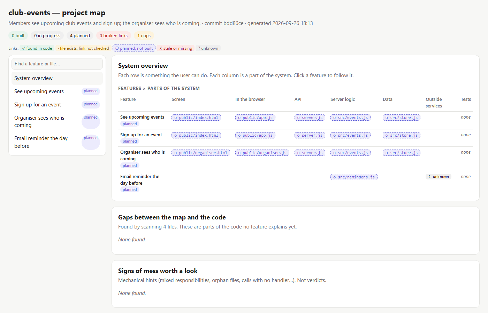
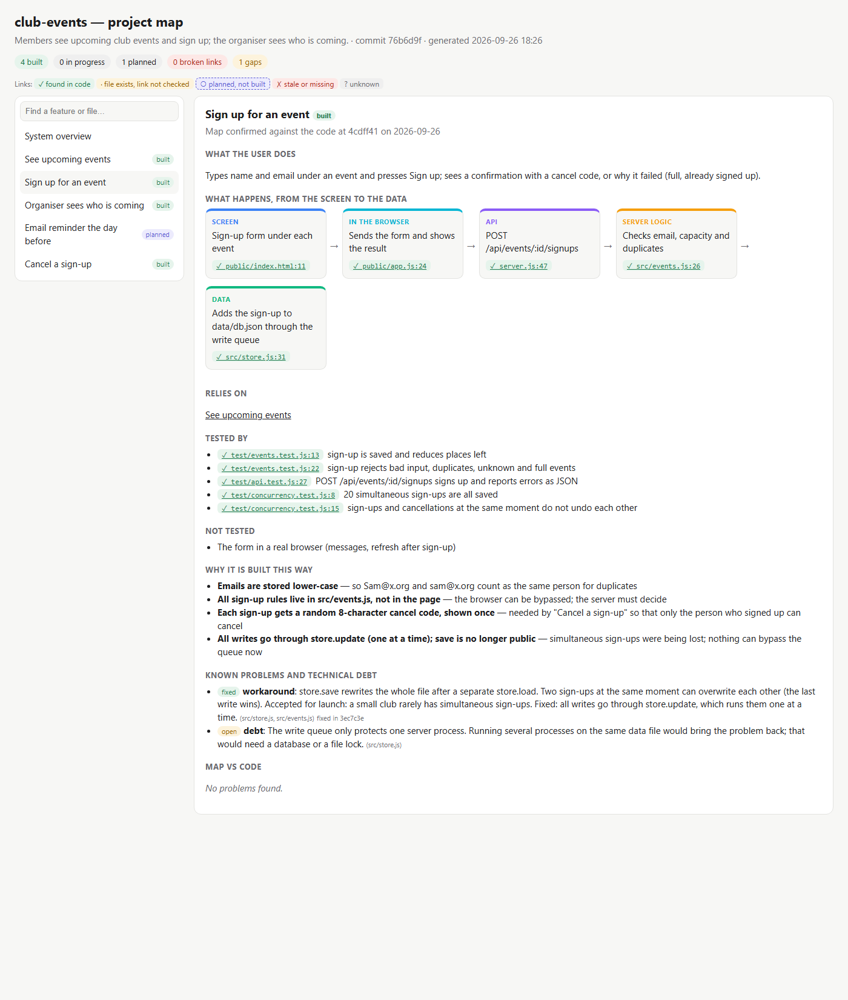
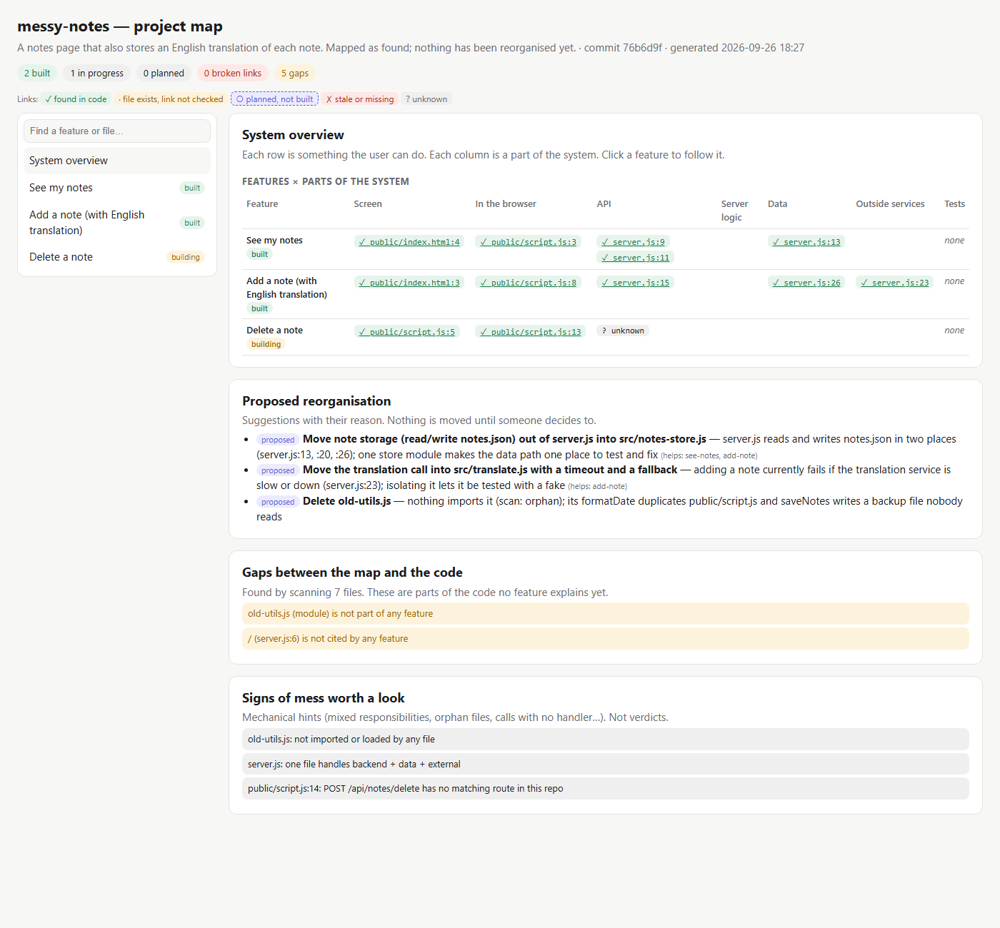

# The living map, walked through for real

This is a record of building [`examples/club-events`](../examples/club-events) from an idea with the Proofcard map, then mapping a messy existing app ([`examples/messy-notes`](../examples/messy-notes)). It ran on Windows with Node 24 on 2026-09-26.
All outputs are real (trimmed). Commit hashes like `05c9b5a` belong to the original build repository. The copies in this repo were re-confirmed with `map mark` against this repository's history.
[`test/map.test.js`](../test/map.test.js) replays the key behaviours on every CI build.

**Live map of the result:** [club-events](https://moosartist.github.io/proofcard/demo/club-events.html) · [messy-notes](https://moosartist.github.io/proofcard/demo/messy-notes.html) · [club-events at the idea stage](https://moosartist.github.io/proofcard/demo/club-events-at-idea-stage.html)

---

## 1. Idea → initial map (nothing built)

The idea: *members see upcoming club events and sign up; the organiser sees who is coming.*

`proofcard init`, then `proofcard map add` for four features, then each feature's planned journey, with the files it will use and a `structure` line for each part's responsibility. The email provider for reminders wasn't decided, so it was written as `unknown` rather than invented.

```text
$ proofcard map check
Map check: 0 error(s), 1 warning(s), 0 note(s)
Feature reminder
  warn  UNKNOWN_LINK: step 2 (external) is marked unknown: "Sends the email (provider not chosen yet)"

$ proofcard map show sign-up
  3. [api] POST /api/events/:id/signups
     ○ planned  server.js
  4. [service] Checks email, capacity and duplicates
     ○ planned  src/events.js
```



## 2. Build → the map notices

After building pages, API, rules (`src/events.js`) and storage (`src/store.js`), with 9 tests:

```text
Feature sign-up
  info  PLANNED_EXISTS: marked planned, but every step already exists in the code: update status?
Project
  warn  UNMAPPED_ROUTE: /app.js (server.js:11) is not cited by any feature
  warn  UNMAPPED_ROUTE: /organiser (server.js:12) is not cited by any feature
```

The map was updated: statuses set to `built`, the page routes added to the features that need them, tests linked by name, untested parts listed, decisions with reasons. One piece of debt was **knowingly accepted** and recorded: `store.save` rewrites the whole file after a separate load, so simultaneous sign-ups can overwrite each other. After a commit, `proofcard map mark` confirmed each feature against that commit.

## 3. A new feature: cancel a sign-up

**Before touching code**, the map was asked what's affected:

```text
$ proofcard map impact sign-up
Files involved: public/index.html, public/app.js, server.js, src/events.js, src/store.js, test/events.test.js, test/api.test.js
Also affected: list-events, attendee-list, reminder
Re-run these tests: test/events.test.js, test/api.test.js
Open problems here:
  - [sign-up] workaround: store.save rewrites the whole file after a separate store.load. ...
```

This shaped the design: cancelling needs a secret code given at sign-up (email alone would let anyone cancel anyone), and the rules go in `src/events.js` per `structure`. The feature went into the map as `planned` first, then it was built.

While the change was half done, the map reported what had moved:

```text
Feature sign-up
  warn  DRIFT: changed since the map was confirmed (05c9b5a): src/events.js
  warn  TESTS_NOT_UPDATED: code changed (src/events.js) but none of its tests did
```

Two existing tests also failed (sign-up now returns a cancel code), and one new test failed because cancelling returned 201. Both were fixed, and then the map was updated and re-confirmed.

## 4. Months later: "two people signed up, only one is in the list"

Someone coming back doesn't remember the code, so they ask the map:

```text
$ proofcard map impact src/store.js
Start at: Sign up for an event [sign-up] → src/store.js (data: Adds the sign-up to data/db.json)
Start at: Cancel a sign-up [cancel] → src/store.js (data: Removes the sign-up from data/db.json)
Re-run these tests: test/events.test.js, test/api.test.js
Known untested parts:
  - Sign up for an event: Two people signing up at the same moment
Open problems here:
  - [sign-up] workaround: store.save rewrites the whole file after a separate store.load. Two sign-ups at the same moment can overwrite each other ...
```

The map pointed at the recorded debt, at the matching "not tested" item, and at something easy to miss: **cancelling writes the same way**, so the fix must cover it too.

Reproduced first (as a bug-fix card with a regression test):

```text
✖ 20 simultaneous sign-ups are all saved
    actual: 1,
    expected: 20,
```

Fix: every write goes through `store.update()`, which runs changes one at a time, and `save` is no longer public. Then:

```text
$ proofcard verify
| regression proof | PASS | fails before the fix (exit 1), passes after (exit 0) |
| check: test | PASS | `npm test` exited 0 |

$ proofcard map check
  error STALE_LINK: step 5 (data): "function save" is no longer in src/store.js     ← sign-up
  error STALE_LINK: step 5 (data): "function save" is no longer in src/store.js     ← cancel
  warn  TESTS_NOT_UPDATED: code changed (src/events.js, src/store.js) but none of its tests did
```

The map wouldn't let the old description survive the change. It was updated: the steps now cite `function update`, the new concurrency tests are linked, the debt is marked `fixed`, the untested item is removed, and the remaining limit is recorded honestly as new debt ("only protects one server process"). Re-confirmed, then `map check` came back clean.



## 5. Release

`proofcard ready` first failed on the missing brief, README and smoke check. Then the smoke check printed four "ok" lines **and crashed on exit** (Windows exit code 3221226505). `ready` goes by exit codes, so it reported FAIL, and the script was fixed. The final result was `# Release readiness: READY`, with `project map | PASS | 5 feature(s) match the code`.

## 6. An existing messy app

`examples/messy-notes` is written the way vibe-coded apps often look: one `server.js` doing routes, file storage and a translation API, no tests, a leftover file, and a delete button.

```text
$ proofcard map scan
API calls from the browser:
  GET /api/notes  public/script.js:4 → server.js:11
  POST /api/notes  public/script.js:9 → server.js:15
  POST /api/notes/delete  public/script.js:14 → no handler found
Outside services:
  https://api.example-translate.com  server.js:23
Signs of mess (hints, not verdicts):
  orphan: old-utils.js — not imported or loaded by any file
  mixed-responsibility: server.js — one file handles backend + data + external
  unhandled-call: public/script.js:14 — POST /api/notes/delete has no matching route in this repo
```

The draft map uses only these facts. "Delete a note" is `building`, and its API step is `unknown` (nothing handles it). Suspicions from reading the code (an XSS risk in `innerHTML`, the translation "temporary hack") are recorded as debt and labelled as the assistant's inference. The reorganisation is written as **proposals with reasons**. Nothing was moved.



## What the trial found in Proofcard itself (all fixed, with tests)

| Found while using it | Fix |
|---|---|
| A planned feature's step pointing at an existing file showed as **STALE** before the text was written | not written yet = `planned` for planned work, `stale` only for built work |
| The scanner read a status message (`'GET /app.js'` in a script) as a server route | routes only from files that run a server |
| `fetch(..., { method: 'POST' })` was recorded as GET | method read from the whole call |
| `req.url === '/x' && req.method === 'POST'` was treated as any method, so POST was linked to the GET handler | method read from the same condition |
| `/` counted as "cited" by any text containing a slash, which hid a gap | a route counts only if its whole path string is quoted |
| Same function name in browser and server (`signUp`) flagged as duplication | only compared within the same part |
| "Missing step" blamed a feature for calls in a shared file that belong to other features | only warned when no feature using that file explains the call |
| `impact <file>` said "start at the screen" | starts at the step inside that file |
| The brief repeated design and decisions that now live in the map | brief keeps only what the map doesn't cover |

## Would a non-programmer understand it?

I couldn't test this with a real non-programmer, so it's **not proven**. What I did check is that the questions below can be answered from the map page alone, and that every answer matches the code:

| Question | Where the map answers it |
|---|---|
| Where is a sign-up saved? | Sign up → Data: `src/store.js:31`, "Adds the sign-up to data/db.json through the write queue" |
| If I change how events are stored, what could break? | `impact src/store.js`: all four built features, plus which tests to run |
| Is the reminder email working? | Overview: "Email reminder… planned"; provider "? unknown" |
| What hasn't been tested? | Each feature's "Not tested" list (e.g. the forms in a real browser) |
| Why do I need a code to cancel? | Cancel → "Why it is built this way" |
